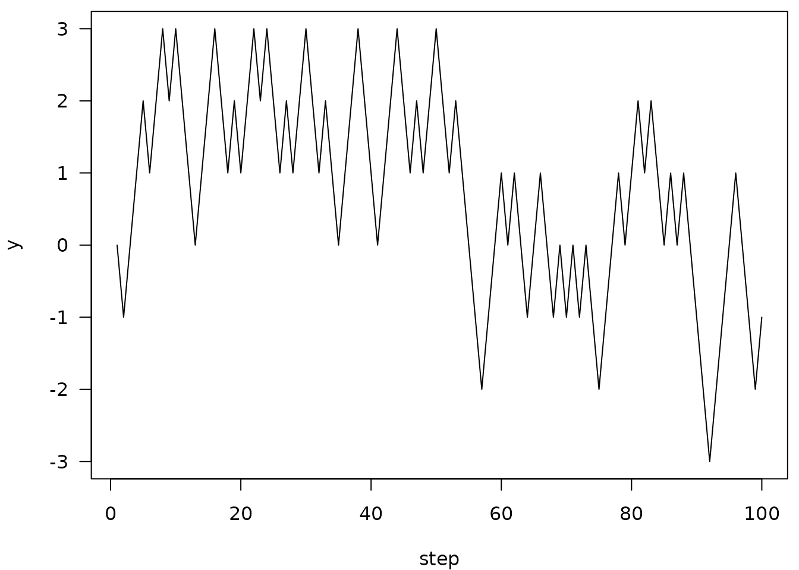
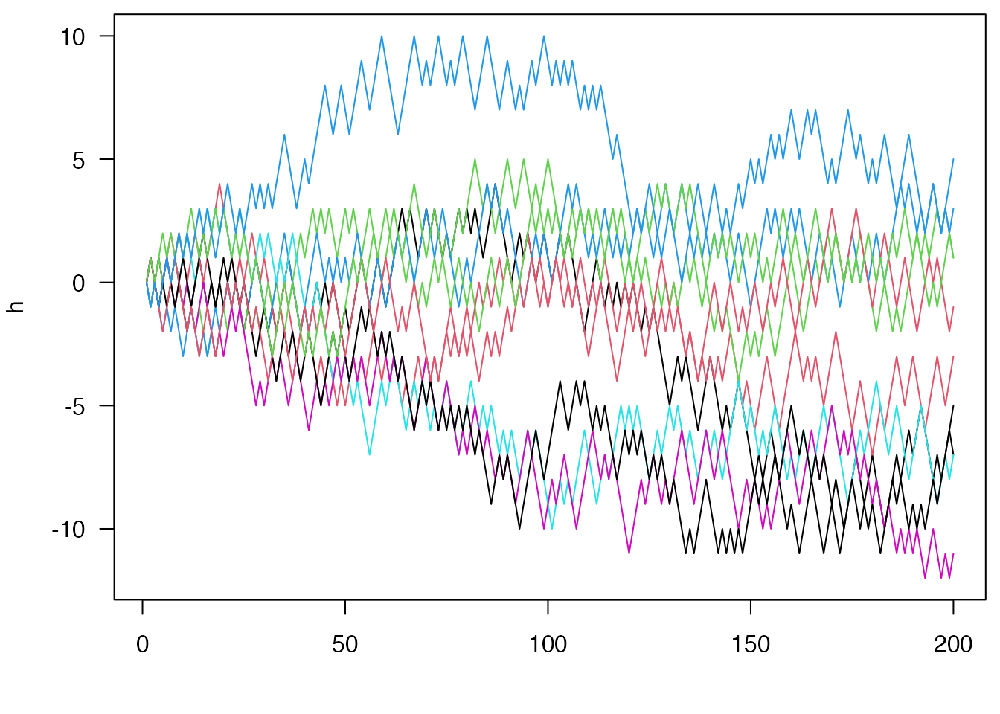

# ring applications

The bytes-based ring buffer in the main vignette is a better data
structure to implement the simulation than the environment buffer is
because the expected elements in each entry of the buffer are the same.
But with a bit of S3 syntactic sugar we can do a bit better. This
vignette is an attempt at creating “ring” versions of a vector and
matrix data type.

NOTE: this vignette used to be implemented in the package itself, but I
pulled it out of the package because I felt that the implementation
wasn’t quite right, and that it may not be ideal to have objects that
appear to have normal-R semantics operate by side effect. However, this
may give some ideas for how to use ring buffers in practice.

## Ring vector

The actual code for the buffer here is available in the package via
`system.file("examples/ring_vector.R", package = "ring")` (the path
depends on your R and package installations).

``` r
## Simulate an atomic vector or matrix with a ring buffer.  These
## functions exist mostly as an example of use of a ring buffer
## designed to work with R functions that do not know (or care) that
## the object is implemented with a ring buffer behind the scenes.
## Elements will be added at the end of the vector and taken from the
## beginning.
##
## Note that because the matrix is stored row-wise but R stores
## matrices column wise, there is a lot of data transposing going on
## here.  If something like this was needed for performance then
## you'd want to redo this with column storage.
##
## The `push` function is generic and can be used to push
## elements onto either a `ring_vector` or a `ring_matrix`.
##
## Note that these are implemented more as proof-of-concepts rather
## than really robust data types.
##
## * `length_max`: The maximum number of elements
## * `type`: The type of storage.  Can be "logical", "integer",
##   "double", or "complex"
## * `environment`: Logical indicating if we should use an environment
##   buffer (`ring_buffer_env`) or a bytes buffer
##   (`ring_buffer_bytes`).
ring_vector <- function(length_max, type, environment = TRUE) {
  type <- match.arg(type, names(create))
  if (environment) {
    buf <- ring::ring_buffer_env(length_max)
  } else {
    buf <- ring::ring_buffer_bytes_typed(length_max, type, 1L)
  }
  ret <- list(buf = buf, length_max = as.integer(length_max),
              type = type, environment = environment)
  class(ret) <- "ring_vector"
  ret
}

ring_vector_push <- function(buffer, data, check = TRUE, ...) {
  if (check) {
    ring_vector_compatible(buffer, data)
  }
  buffer$buf$push(data)
}

ring_vector_compatible <- function(x, data) {
  if (storage.mode(data) != x$type) {
    stop("Expected storage.mode of ", x$type)
  }
  TRUE
}

ring_vector_get <- function(x, i = NULL) {
  if (is.null(i)) {
    ret <- x$buf$read(x$buf$used())
    if (x$environment) {
      if (length(ret) == 0L) {
        ret <- create[[x$type]]()
      } else {
        ret <- unlist(ret)
      }
    }
  } else {
    len <- x$buf$used()
    i <- ring_vector_index(i, len)
    ret <- create[[x$type]](length(i))
    for (j in seq_along(i)) {
      k <- i[[j]]
      ret[j] <- if (k <= len) x$buf$tail_offset(k - 1L) else NA
    }
  }

  ret
}

ring_vector_index <- function(i, len) {
  if (is.logical(i)) {
    if (length(i) < len) {
      i <- rep_len(i, len)
    }
    i <- which(i)
  } else if (!is.numeric(i)) {
    stop("Invalid type for index")
  } else if (any(i < 0)) {
    i <- seq_len(len)[i]
  }
  i
}

## S3 support:
push <- function(buffer, data, ...) {
  UseMethod("push")
}

push.ring_vector <- ring_vector_push

length.ring_vector <- function(x, ...) {
  x$buf$used()
}

`[[.ring_vector` <- `[.ring_vector` <- function(x, i, ...) {
  if (missing(i)) {
    ring_vector_get(x, NULL)
  } else {
    ring_vector_get(x, i)
  }
}

c.ring_vector <- function(..., recursive = TRUE) {
  if (!inherits(..1, "ring_vector")) {
    args <- list(...)
    i <- vapply(args, inherits, logical(1), "ring_vector")
    args[i] <- lapply(args[i], as.matrix)
    eval(as.call(c(quote(rbind), args)))
  } else {
    x <- ..1
    args <- list(...)[-1]
    lapply(args, ring_vector_compatible, x = x)
    for (m in args) {
      ring_vector_push(x, m)
    }
    x
  }
}

## Support functions; these are functions used to create empty storage
## for the bytes buffers
create <- list(logical = logical,
               integer = integer,
               double = double,
               complex = complex)

registerS3method("[", "ring_vector", `[.ring_vector`, environment())
registerS3method("[[", "ring_vector", `[[.ring_vector`, environment())
registerS3method("length", "ring_vector", length.ring_vector, environment())
registerS3method("c", "ring_vector", c.ring_vector, environment())
```

Then create an integer ring vector of length 5:

``` r
v <- ring_vector(5, "integer", FALSE)
```

Convert back out to be an R vector (involves a copy)

``` r
v[]
```

    ## integer(0)

To add things to the vector, use the `push` generic:

``` r
push(v, 1L)
v[]
```

    ## [1] 1

This can push multiple items on at once:

``` r
push(v, 2:4)
v[]
```

    ## [1] 1 2 3 4

``` r
length(v)
```

    ## [1] 4

Random read access works:

``` r
v[3]
```

    ## [1] 3

``` r
v[[1]]
```

    ## [1] 1

Resetting the buffer zeros this all:

``` r
v$buf$reset()
```

    ## NULL

``` r
length(v)
```

    ## [1] 0

Returning to the simulation example from the main vignette:

``` r
buf <- ring_vector(5, "integer", FALSE)
h <- integer(20)
x <- 0L
push(buf, x)
h[1L] <- x

step <- function(x) {
  if (runif(1) < 0.5) x - 1L else x + 1L
}

set.seed(1)
for (i in seq_len(length(h) - 1L)) {
  x <- step(x)
  push(buf, x)
  h[i + 1L] <- x
}
```

The whole history:

``` r
h
```

    ##  [1]  0 -1 -2 -1  0 -1  0  1  2  3  2  1  0  1  0  1  0  1  2  1

The last 5 steps:

``` r
buf[]
```

    ## [1] 1 0 1 2 1

Now, rewriting again, this time with the step function taking the buffer
itself. This simplifies the implementation, with most of the details
being handled by the S3 methods for `length`, `push` and `[`.

``` r
step <- function(x) {
  if (length(x) > 1) {
    p <- mean(diff(x[])) / 2 + 0.5
  } else {
    p <- 0.5
  }
  if (runif(1) < p) x[length(x)] - 1L else x[length(x)] + 1L
}

buf <- ring_vector(5, "integer", FALSE)
h <- integer(100)
x <- 0L

push(buf, x)
h[1L] <- x

set.seed(1)
for (i in seq_len(length(h) - 1L)) {
  x <- step(buf)
  push(buf, x)
  h[i + 1L] <- x
}

par(mar=c(4, 4, .5, .5))
plot(h, type="l", xlab="step", ylab="y", las=1)
```



## Ring matrix with `ring_matrix`

The `ring_matrix` data structure generalises the `ring_vector`; it is a
buffer that looks to R like a matrix that grows by adding rows at the
bottom and shrinks by consuming rows at the top.

``` r
## * `nr_max`: The maximum number of rows
## * `nc`: The number of columns in the matrix
ring_matrix <- function(nr_max, nc, type, environment = TRUE) {
  type <- match.arg(type, names(ring:::sizes))
  if (environment) {
    buf <- ring::ring_buffer_env(nr_max)
  } else {
    buf <- ring::ring_buffer_bytes_typed(nr_max, type, nc)
  }
  ret <- list(buf = buf, nr_max = as.integer(nr_max), nc = as.integer(nc),
              type = type, environment = environment)
  class(ret) <- "ring_matrix"
  ret
}

ring_matrix_push <- function(buffer, data, check = TRUE, ...) {
  if (check) {
    ring_matrix_compatible(buffer, data)
  }
  if (buffer$environment) {
    if (is.matrix(data)) {
      for (i in seq_len(nrow(data))) {
        buffer$buf$push(data[i, ], FALSE)
      }
    } else {
      buffer$buf$push(data, FALSE)
    }
  } else {
    buffer$buf$push(if (is.matrix(data)) t(data) else data)
  }
}

ring_matrix_compatible <- function(x, data) {
  if (storage.mode(data) != x$type) {
    stop("Expected storage.mode of ", x$type)
  }
  if (is.matrix(data)) {
    if (ncol(data) != x$nc) {
      stop(sprintf("Expected a matrix of '%d' columns", x$nc))
    }
  } else {
    if (length(data) != x$nc) {
      stop(sprintf("Expected a matrix of '%d' columns", x$nc))
    }
  }
  TRUE
}

ring_matrix_get <- function(x, i = NULL) {
  if (is.null(i)) {
    dat <- x$buf$read(x$buf$used())
    if (x$environment) {
      if (length(dat) == 0L) {
        dat <- create[[x$type]]()
      } else {
        dat <- unlist(dat)
      }
    }
    ret <- matrix(dat, ncol = x$nc, byrow = TRUE)
  } else {
    len <- x$buf$used()
    i <- ring_vector_index(i, len)
    ret <- matrix(create[[x$type]](length(i) * x$nc), length(i), x$nc)
    for (j in seq_along(i)) {
      k <- i[[j]]
      ret[j, ] <- if (k <= len) x$buf$tail_offset(k - 1L) else NA
    }
  }

  if (!is.null(x$colnames)) {
    colnames(ret) <- x$colnames
  }

  ret
}

## S3 support
push.ring_matrix <- ring_matrix_push

dim.ring_matrix <- function(x, ...) {
  c(x$buf$used(), x$nc)
}

head.ring_matrix <- function(x, n = 6L, ...) {
  head.matrix(x, n, ...)
}

tail.ring_matrix <- function(x, n = 6L, ...) {
  tail.matrix(x, n, FALSE, ...)
}

`[.ring_matrix` <- function(x, i, j, ..., drop = TRUE) {
  if (missing(i)) {
    if (missing(j)) {
      ring_matrix_get(x, NULL)
    } else {
      ring_matrix_get(x, NULL)[, j, drop = drop]
    }
  } else if (is.matrix(i)) {
    if (!missing(j)) {
      stop("subscript out of bounds") # same error as [.matrix
    }
    j <- sort(unique(i[, 1L]))
    ring_matrix_get(x, j)[cbind(match(i[, 1L], j), i[, 2L])]
  } else {
    ring_matrix_get(x, i)[, j, drop = drop]
  }
}

dimnames.ring_matrix <- function(x, ...) {
  if (is.null(x$colnames)) {
    NULL
  } else {
    list(NULL, x$colnames)
  }
}

`dimnames<-.ring_matrix` <- function(x, value) {
  if (is.null(value)) {
    x$colnames <- NULL
  } else if (!is.list(value) || length(value) != 2L) {
    stop("Invalid input for dimnames")
  } else {
    if (!is.null(value[[1L]])) {
      stop("Cannot set rownames of a ring matrix")
    }
    val <- value[[2L]]
    if (!is.null(val) && length(val) != x$nc) {
      stop("Invalid length dimnames")
    }
    x$colnames <- val
  }
  x
}

as.matrix.ring_matrix <- function(x, ...) {
  ring_matrix_get(x, NULL)
}

cbind.ring_matrix <- function(...) {
  stop("It is not possible to cbind() ring_matrices (use as.matrix first?)")
}

rbind.ring_matrix <- function(...) {
  if (!inherits(..1, "ring_matrix")) {
    args <- list(...)
    i <- vapply(args, inherits, logical(1), "ring_matrix")
    args[i] <- lapply(args[i], as.matrix)
    eval(as.call(c(quote(rbind), args)))
  } else {
    x <- ..1
    args <- list(...)[-1]
    lapply(args, ring_matrix_compatible, x = x)
    for (m in args) {
      ring_matrix_push(x, m)
    }
    x
  }
}

length.ring_matrix <- function(x) {
  x$buf$used() * x$nc
}

registerS3method("[", "ring_matrix", `[.ring_matrix`, environment())
registerS3method("dim", "ring_matrix", dim.ring_matrix, environment())
registerS3method("dimnames", "ring_matrix", dimnames.ring_matrix, environment())
registerS3method("dimnames<-", "ring_matrix", `dimnames<-.ring_matrix`,
                 environment())
registerS3method("as.matrix", "ring_matrix", cbind.ring_matrix, environment())
registerS3method("cbind", "ring_matrix", cbind.ring_matrix, environment())
registerS3method("rbind", "ring_matrix", rbind.ring_matrix, environment())
```

This is even more contrived than above, but consider simultaneously
simulating the movement of `n` random particles with the same reflecting
random walk as above. First create a 10 x 5 ring matrix:

``` r
n <- 10
m <- ring_matrix(5, n, "integer", FALSE)
```

The current state of the matrix is:

``` r
m[]
```

    ##      [,1] [,2] [,3] [,4] [,5] [,6] [,7] [,8] [,9] [,10]

We can set the initial state as:

``` r
push(m, matrix(0L, 1, n))
m[]
```

    ##      [,1] [,2] [,3] [,4] [,5] [,6] [,7] [,8] [,9] [,10]
    ## [1,]    0    0    0    0    0    0    0    0    0     0

``` r
step <- function(m) {
  if (nrow(m) > 1) {
    p <- colMeans(diff(m[])) / 2 + 0.5
  } else {
    p <- rep(0.5, ncol(m))
  }
  m[nrow(m), ] + as.integer(ifelse(runif(length(p)) < p, -1, 1L))
}

m <- ring_matrix(5, n, "integer", FALSE)
x <- rep(0L, n)
push(m, x)

h <- matrix(NA, 200, n)
h[1, ] <- x
set.seed(1)
for (i in seq_len(nrow(h) - 1L)) {
  x <- step(m)
  push(m, x)
  h[i + 1L, ] <- x
}

par(mar=c(4, 4, .5, .5))
matplot(h, type="l", lty=1, las=1)
```


